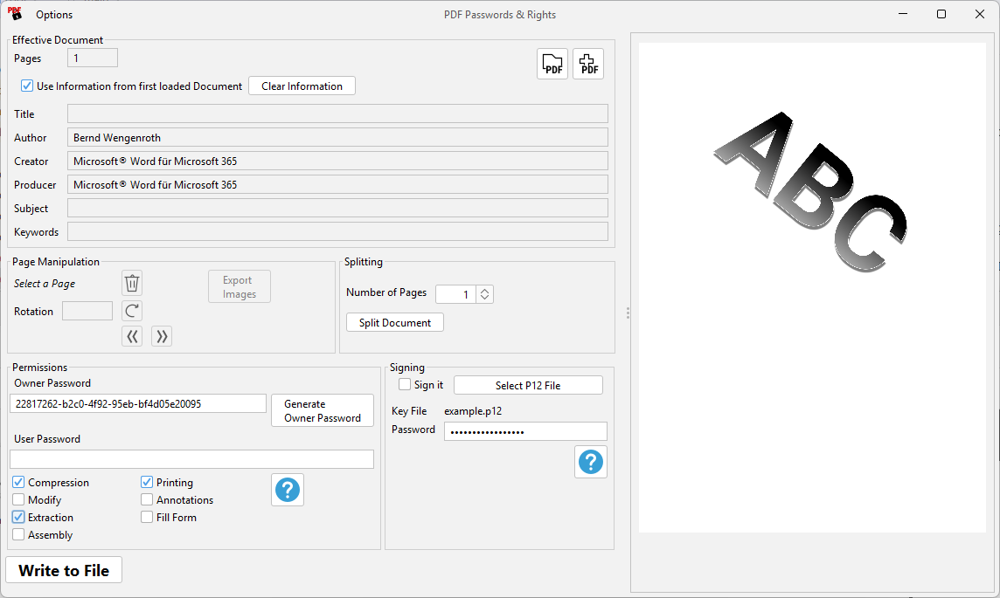

= jPdfTool

Apache PDFBox based tool to modify PDFs without paying any money.

This project began when I needed to protect a scanned PDF for an email, but the HP Scanner software couldn’t handle it. 
My old Brother scanner had this feature - plus other useful tools - and (by the way) worked without requiring any registration. 
Rather than paying for Adobe or other commercial solutions, I turned to the PDFBox documentation.  
I had used PDFBox in previous commercial projects, though I’d never dealt with PDF protection before.

Thirty minutes later, the first version was up and running, and I sent the email. 
The following days were spent adding fancy features to the UI and the build system - just for fun.

== Current Features

=== Load a PDF

Easily import PDF documents for editing

=== Merge Multiple PDFs

Add additional PDFs and either mix pages or append them sequentially.

=== Set Owner and User Passwords

You can set either an owner or a user password if specific permissions aren't required. 
Both options provide basic encryption and restrict viewing access.

=== Enable/Disable Compression

Toggle compression to optimize file size.

=== Set Permissions

Permissions only take effect when a owner password is set. 
The UI automatically disables permission checkboxes unless the password is provided.

=== Remove &amp; Rearrange Pages

Delete pages or change their order.

=== Rotate Pages

Rotate pages by 90°, 180° or 270°.

=== Preview PDF

For you convenience the document is shown using PDFBox’s rendering engine
(rending runs in background).

=== Export Embedded Images

Display and export embedded images. 
Some PDF tools seems to split images into fragments - this tool can provide a merged version for you.

=== Load Protected PDFs

Allows you to remove or change existing passwords. 
If the current entered owner password does not match the original password of the loaded PDF, the UI will prompt you to
enter the correct one. 
This password input is masked and will not be shown in the UI afterward.

=== Store the File

Saves your modified PDF.

=== Split into Multiple Documents

Export the PDF into separate documents.

=== Switch "Look-And-Feels"

Toggle between FlatLaf Dark/Light themes or system defaults. 
The setting is stored in user-preferences.

=== Sign the File with a Certificate

Sign the file using a certificate. 
A `.p12` file with an X.509 certificate is required.

== TODOs

E-mail me if I missed important features. 

== Supported Operating Systems

Distributions are currently only created for *MS Windows*.

The OS-dependent components are only the starter executable and the bundled JRE, designed to make it eeeeasy for Windows users.

The included JAR files in the `lib` folder should run on *any operating system with Java installed*.

For example, on *Linux* or *macOS*, you can run the application using the following command:

[source,console]
----
java -cp "$(printf %s: lib/*.jar)" com.bw.jPdfTool.Main
----

This command simply adds all JARs in the lib folder to the classpath.
The main class is `com.bw.jPdfTool.Main`.
Calling it without any arguments will launch the *Graphical User Interface (GUI)*.

==️ Command Line Interface (CLI)

In case you need to call the tool from a *CI/CD Pipeline* or script,
you can use the CLI.  I assume you have a basic understanding of command-line operations.

*Prerequisites:*
+ The current directrory of your shell (e.g. Bash) is in the distribution root directory.
+ You have a *Java Runtime Environment (JRE)* installed - _see below for *headless* environments_.

To show the usage information of the CLI, use:

[source,console]
----
java -cp "$(printf %s: lib/*.jar)" com.bw.jPdfTool.Main -h
----

*Note:* The CLI currently supports only a subset of the tool's total functionality. 
Feel free to ask in case you need special functionality.

=== Headless Environment Considerations

Because the tool uses *PDFBox* for all the magic, there are special considerations for headless environments:
+ *GUI is not created for CLI:* If the CLI is used, the User Interface is not created, so it should run on a headless system (a server without a display).
+ *AWT Dependency:* PDFBox internally uses some *Abstract Window Toolkit (AWT)* classes. These classes may require a *full JRE* to work, even if the application is running "off-screen" without a physical display installed.
+ *Pure Headless JRE Risk:* A _pure_ headless JRE might throw an error when an AWT class is instantiated. While you might use the CLI on a headless system, using a JRE specifically configured as _purely_ headless may be problematic.

*Recommendation:* Try running it. Success depends on the specific headless JRE implementation you are using.